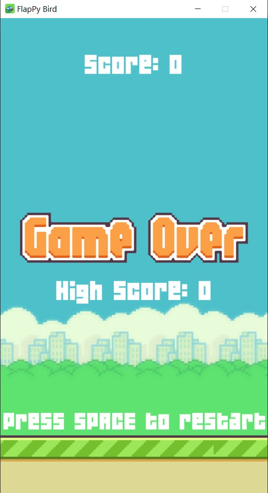

# FlapPy_bird
A flappy bird clone using the pygame module of Python   


<p align = "center">
    
</p>

<p align = "center">
  
</p>


# Requirements
Python 3
requirements.txt file included.
Use:
```pip install -r requirements.txt ``` or ```pip install pygame```   
    
# Files  
requirements.txt - Includes the list of external libraries needed to run this program(pygame).    
game.py - The main game code      
assets - The image file required for graphics      
sounds - The audio files for events    
04B_19.TTF - Original Font file for flappy bird  
flappy.jpg, flappy_p.jpg and flappy_g.jpg - Screenshots of three screen modes   

# Acknowledgement
[Samuel Custodio - For providing the flappy bird assets and sound files](https://github.com/samuelcust/flappy-bird-assets )  


